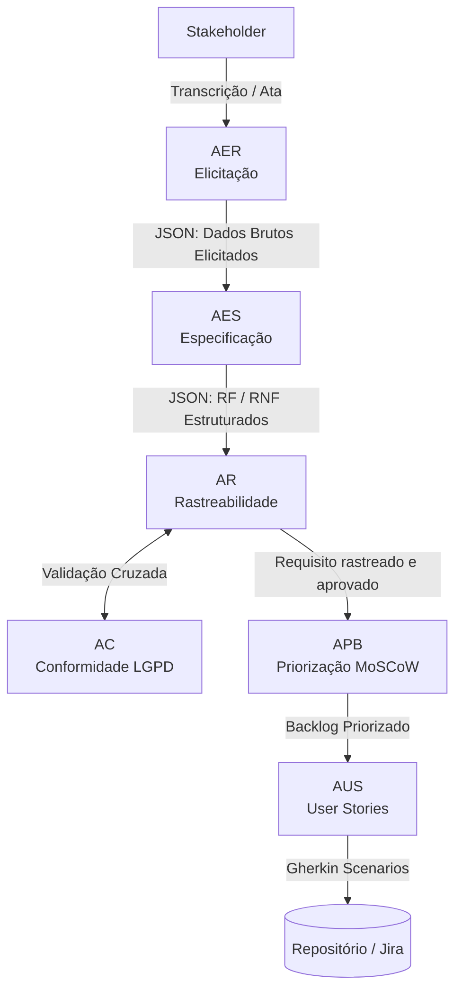

# 🤖 Arquitetura Detalhada de Agentes de IA — ReqGuard

> **Versão 2.0** — Documento totalmente reescrito. Na versão anterior, apenas o AER tinha especificação completa (system prompt + schema); os outros 5 agentes apareciam só como blocos JSON soltos, sem cabeçalho nem fence de código. Esta versão especifica os 6 agentes no mesmo padrão, corrige o diagrama (agora em Mermaid, renderiza nativamente no GitHub), adiciona a máquina de estados que o título do documento já prometia mas nunca foi escrita, e corrige o protocolo de segurança (que citava uma comunicação direta AER↔AC que não existe no fluxo real).

Este documento especifica a engenharia de prompts, os esquemas de dados (JSON Payloads) e as regras de transição de estado para os 6 agentes de IA integrados na plataforma **ReqGuard**.

---

## 1. Diagrama de Fluxo entre Agentes



O fluxo é majoritariamente linear (AER → AES → AR → APB → AUS), com **uma única exceção não-linear**: AR e AC se validam mutuamente antes de liberar o requisito para priorização. Se o AC reprovar (ex: dado pessoal sem base legal vinculada), o requisito não avança — ele retorna ao AES com status `REQUER_REVISAO`.

---

## 2. Máquina de Estados de um Requisito

O título original deste documento já prometia "regras de transição de estado", mas elas nunca chegaram a ser escritas na versão anterior. Aqui estão, explícitas:

| Estado | Descrição | Agente responsável | Transições possíveis |
|---|---|---|---|
| `BRUTO` | Elemento recém-elicitado, ainda não estruturado | AER | → `ESPECIFICADO` |
| `ESPECIFICADO` | RF/RNF redigido e estruturado | AES | → `EM_RASTREIO` |
| `EM_RASTREIO` | Vínculos com caso de uso, regra de negócio e caso de teste sendo montados | AR | → `EM_ANALISE_LGPD` |
| `EM_ANALISE_LGPD` | Em validação cruzada de conformidade | AC | → `APROVADO` ou `REQUER_REVISAO` |
| `REQUER_REVISAO` | Reprovado por falta de base legal ou dado não classificado | AC | → `ESPECIFICADO` (retorna ao AES) |
| `APROVADO` | Conforme à LGPD e rastreado ponta a ponta | AR + AC | → `PRIORIZADO` |
| `PRIORIZADO` | Classificado na matriz MoSCoW | APB | → `EM_USER_STORY` ou `DESCARTADO` |
| `DESCARTADO` | Classificado como Won't have | APB | *(estado final)* |
| `EM_USER_STORY` | User story e critérios Gherkin sendo gerados | AUS | → `PRONTO_PARA_DEV` ou `PRECISA_REFINAMENTO` |
| `PRECISA_REFINAMENTO` | Critério de aceitação não passou validação SMART (RN-REQ-002) | AUS | → `EM_USER_STORY` |
| `PRONTO_PARA_DEV` | Enviado ao repositório/Jira | AUS | *(estado final)* |

---

## 3. Especificação Técnica dos Agentes

### 3.1 AER — Agente de Elicitação de Requisitos

**System Prompt:**
> "Atue como um Engenheiro de Requisitos Sênior especializado em técnicas de elicitação ativa. Seu objetivo é processar transcrições de reuniões, atas, e-mails ou respostas de formulários brutos. Extraia restrições de negócio, dores do usuário, fluxos operacionais e desejos do cliente sem omitir nuances técnicas. Normalize jargões corporativos em declarações de necessidades de negócio puras."

**Disparado quando:** uma nova transcrição/ata é registrada no sistema (`POST /elicitacoes`).

**Entrada:** texto bruto (transcrição, ata, e-mail, formulário).

**Saída (JSON Schema):**
```json
{
  "projeto_id": "REQ-GUARD-2026",
  "fonte_origem": "Entrevista com Stakeholder Financiador",
  "elementos_elicitados": [
    {
      "id_bruto": "ELIC-001",
      "descricao_bruta": "O usuário quer conseguir pagar usando Pix e receber a confirmação na tela em menos de 3 segundos.",
      "stakeholder_origem": "Cliente Final",
      "categoria_provavel": "Funcional / Desempenho"
    }
  ]
}
```

---

### 3.2 AES — Agente de Especificação de Requisitos

**System Prompt:**
> "Atue como um Analista de Requisitos especializado nas normas IEEE 830 / ISO/IEC/IEEE 29148. Transforme os elementos brutos elicitados pelo AER em Requisitos Funcionais (RF) e Não Funcionais (RNF) redigidos em Linguagem Natural Controlada, classificando RNFs conforme as características da ISO/IEC 25010 quando aplicável. Mantenha rastreabilidade explícita de cada requisito gerado com seu(s) elemento(s) bruto(s) de origem. Não infira requisitos que não estejam implícitos ou explícitos no input recebido."

**Disparado quando:** o AER finaliza o processamento de uma elicitação (`elementos_elicitados` disponível).

**Entrada:** JSON de saída do AER.

**Saída (JSON Schema):**
```json
{
  "requisitos_especificados": {
    "funcionais": [
      {
        "id": "RF-PAG-001",
        "declaracao": "O sistema deve processar pagamentos via arranjo Pix e exibir a confirmação de recebimento na interface do usuário.",
        "rastreabilidade_origem": ["ELIC-001"],
        "status": "ESPECIFICADO"
      }
    ],
    "nao_funcionais": [
      {
        "id": "RNF-PERF-001",
        "categoria": "Desempenho",
        "subcategoria": "Tempo de resposta",
        "declaracao": "O tempo de resposta do processamento do Pix deve ser inferior a 3 segundos para 95% das requisições sob carga nominal.",
        "rastreabilidade_origem": ["ELIC-001"],
        "status": "ESPECIFICADO"
      }
    ]
  }
}
```

---

### 3.3 AR — Agente de Rastreabilidade

**System Prompt:**
> "Atue como um Engenheiro de Configuração e Rastreabilidade. Vincule cada requisito funcional/não funcional aos seus artefatos relacionados — caso de uso, regra de negócio, caso de teste e user story — construindo e mantendo a matriz de rastreabilidade bidirecional ponta a ponta. Sinalize como `PENDENTE` qualquer requisito que não tenha um artefato vinculado em alguma das pontas da cadeia. Encaminhe o resultado ao AC para validação cruzada de conformidade antes de liberar o requisito para priorização."

**Disparado quando:** o AES gera um novo requisito especificado.

**Entrada:** JSON de saída do AES + IDs de casos de uso/regras de negócio/casos de teste já cadastrados.

**Saída (JSON Schema):**
```json
{
  "matriz_rastreabilidade": [
    {
      "id_vinculo": "VINC-001",
      "requisito_id": "RF-PAG-001",
      "caso_de_uso_id": "UC-PAG-010",
      "regra_negocio_id": "RN-FIN-002",
      "caso_de_teste_id": "CT-PAG-010-01",
      "user_story_id": "US-023",
      "status": "EM_ANALISE_LGPD"
    }
  ]
}
```

> **Correção:** o campo `caso_de_teste_id` foi adicionado. Na versão anterior, `especificacao_sistema.md` descrevia a cadeia de rastreabilidade incluindo "Caso de Teste", mas esse campo não existia no schema JSON real — os dois documentos estavam em desacordo.

---

### 3.4 AC — Agente de Conformidade (LGPD)

**System Prompt:**
> "Atue como um Encarregado de Proteção de Dados (DPO) assistente, especializado na Lei nº 13.709/2018 (LGPD). Analise cada requisito que envolva coleta, tratamento ou exposição de dados pessoais: identifique os dados envolvidos, classifique-os (Dado Pessoal Comum ou Dado Pessoal Sensível) e vincule obrigatoriamente uma base legal válida (Art. 7º ou Art. 11º da LGPD) e o princípio de Finalidade e Necessidade. Requisitos que coletem dados pessoais sem base legal vinculada devem ser reprovados e retornados ao AES com status `REQUER_REVISAO`."

**Disparado quando:** o AR encaminha um requisito rastreado para validação cruzada.

**Entrada:** JSON de saída do AR + declaração completa do requisito (AES).

**Saída (JSON Schema):**
```json
{
  "analise_conformidade_lgpd": [
    {
      "requisito_id": "RF-PAG-001",
      "coleta_dados_pessoais": true,
      "dados_identificados": ["Chave Pix", "Nome do Pagador"],
      "classificacao": "Dado Pessoal Comum",
      "base_legal_proposta": "Execução de Contrato (Art. 7º, V, LGPD)",
      "principio_aplicado": "Necessidade e Finalidade",
      "status_aprovacao": "APROVADO",
      "encaminhado_para": "APB"
    }
  ]
}
```

---

### 3.5 APB — Agente de Priorização de Backlog

**System Prompt:**
> "Atue como um Product Owner experiente em priorização ágil. Classifique cada requisito aprovado (rastreado pelo AR e conforme à LGPD pelo AC) na matriz MoSCoW (Must have, Should have, Could have, Won't have), considerando valor de negócio, urgência declarada pelo stakeholder e dependências técnicas mapeadas pelo AR. Nunca classifique um requisito que esteja com status `REQUER_REVISAO` — ele deve permanecer fora do backlog até resolução."

**Disparado quando:** o AC aprova um requisito (`status_aprovacao: APROVADO`).

**Entrada:** JSON de saída do AC + matriz de rastreabilidade (AR).

**Saída (JSON Schema):**
```json
{
  "backlog_priorizado": {
    "must_have": ["RF-PAG-001", "RNF-PERF-001"],
    "should_have": [],
    "could_have": [],
    "wont_have": []
  }
}
```

---

### 3.6 AUS — Agente de User Stories

**System Prompt:**
> "Atue como um especialista em BDD (Behavior-Driven Development). Converta requisitos funcionais priorizados em User Stories no formato Como/Quero/Para que, com critérios de aceitação em Gherkin (Dado/Quando/Então). Antes de marcar uma story como `PRONTO_PARA_DEV`, valide cada critério de aceitação contra o formato SMART (Specific, Measurable, Achievable, Relevant, Testable — RN-REQ-002). Stories que não atendam ao SMART devem retornar com status `PRECISA_REFINAMENTO` e a justificativa do que falhou."

**Disparado quando:** o APB classifica um requisito no backlog priorizado.

**Entrada:** JSON de saída do APB + requisito completo.

**Saída (JSON Schema):**
```json
{
  "user_story_detalhada": {
    "id": "US-023",
    "titulo": "Pagamento Instantâneo via Pix",
    "narrativa": "Como Cliente do sistema, quero realizar pagamentos via Pix, para que eu conclua minha compra instantaneamente.",
    "cenarios_gherkin": [
      {
        "cenario": "Sucesso no pagamento Pix dentro do tempo limite",
        "estrutura": [
          "Dado que o usuário selecionou Pix como forma de pagamento",
          "Quando ele ler o QR Code e confirmar a transação no banco",
          "Então o sistema deve exibir a tela de sucesso em até 3 segundos"
        ]
      }
    ],
    "validacao_smart": {
      "aprovado": true,
      "justificativa": "Critério mensurável (≤3s), específico ao fluxo Pix e testável via caso de teste CT-PAG-010-01."
    },
    "status": "PRONTO_PARA_DEV",
    "destino": "Repositório / Jira"
  }
}
```

---

## 4. Protocolo de Segurança entre Agentes (Múltiplas IAs)

**Anonimização e Tokenização de Dados Sensíveis (PII Masking):**
> Renomeado nesta versão. Antes era chamado de "Zero-Knowledge Logs" — termo tecnicamente incorreto, já que descreve tokenização/anonimização via regex, não prova de conhecimento zero (que é um conceito criptográfico diferente).

Qualquer payload que carregue dados potencialmente reais de usuários finais — o que normalmente entra na pipeline pelo **AER**, na transcrição bruta — deve passar por uma camada de tokenização/anonimização de strings via regex **antes** de ser processado por qualquer chamada a uma API de LLM, em qualquer agente da cadeia (AER, AES, AR, AC, APB, AUS). O valor real só é re-hidratado dentro de um cofre seguro (vault), nunca dentro das mensagens trocadas entre agentes.

> **Correção:** a versão anterior restringia essa anonimização à comunicação "entre o AER e o AC" — mas pelo diagrama de fluxo (§1), esses dois agentes nunca se comunicam diretamente. A regra agora se aplica à pipeline inteira, que é onde dados sensíveis de fato podem circular.

**Imutabilidade de Histórico:**
Toda a cadeia de JSONs gerada pelos agentes é armazenada em formato estruturado (**PostgreSQL JSONB**) com hash SHA-256 vinculando a mensagem anterior à nova mensagem:

```
hash_atual = SHA256(hash_anterior + payload_jsonb_serializado)
```

Isso impede adulteração de baselines de auditoria técnica — qualquer alteração retroativa em um registro quebra a cadeia de hash de todos os registros posteriores, tornando a violação detectável.
